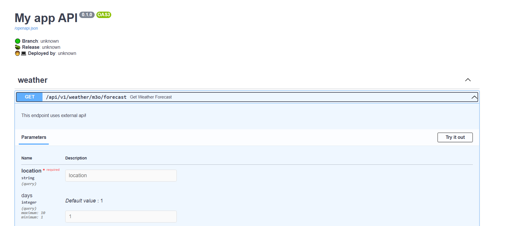

# M3O Weather API Service by FastAPI+Aiohttp


## Local development

1) ### Go to given at [m3o.com](https://m3o.com/) and take your token
2) ### Set it as env var
```shell
export M3O_API_TOKEN=<your_token>
```
3. ### Setup poetry if it`s not
```shell
python -m pip install poetry
poetry config virtualenvs.create false
cd src
poetry shell
poetry install
```


4. ### Run server
```shell
# Start server
cd src && python main.py

```
5. ### Go to http://localhost:80/docs and test it.
